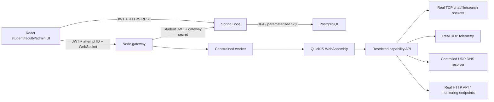

# Architecture

## Responsibilities

Spring Boot owns users, roles, assignment metadata, test cases, attempts, results, submissions, reviews, server metadata, network sessions and audit records. PostgreSQL is the only application database. Flyway owns schema changes; Hibernate validates them.

The gateway validates JWT identity and ownership through Spring Boot before accepting code. Each run receives a snapshot of the enabled database test cases. It executes the student's source in independent workers, evaluates returned values against actual network traces, and sends trusted outcomes back to the API. The API calculates the score using the captured weights; browser clients cannot submit a score.

All controlled services are started within the Node process and bind loopback ports. Browsers use WebSocket capabilities instead of raw TCP/UDP sockets.

## Authentication and authorization

Passwords are hashed with BCrypt. Public registration creates students. Initial admin credentials come from startup environment variables, and admins create faculty through a protected API. JWTs expire after eight hours and contain a per-user revocation version. Logout/status changes invalidate existing sessions.

React keeps the token in sessionStorage, scoped to the current tab. The API verifies the token, current account status and database role on every request. Role-specific routes also check access in React. Student attempts/submissions are restricted to their owner. Faculty have access to the institution's student work; only admins manage users and services.

## Execution boundaries

QuickJS interprets guest JavaScript; student source never executes as host Node.js code. There is no host process, require, unrestricted fetch, module loader or filesystem capability. Fixed service names map to controlled endpoints.

Limits: 32 KiB source, 16 MiB guest heap, 512 KiB stack, 15-second guest deadline and 17-second worker watchdog, 60 capability calls, 16 KiB printed output, 32 KiB result and five saved files. At most four executions run concurrently. Sockets use timeouts and close on worker disposal.

Network traces summarize large payloads with their size/hash. Aggregated stored traces are bounded with an explicit truncation marker. Scores and test outcomes are computed before trace compaction. A crashed run is marked FAILED when its ten-minute execution lease expires, allowing retry.

save(name,content) writes and reads back an actual file in a dedicated scratch directory for the execution. Names cannot contain paths or reserved devices. Saved content is checked for integrity during evaluation and included in returned output, with browser download buttons for file assignments. The parent removes the verified scratch directory when a worker finishes or is terminated. No host file path is exposed.
