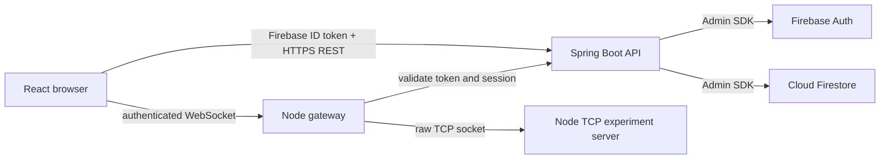

# LabLink architecture

The API owns identity, authorization, experiment metadata, sessions, submissions, and Firestore access. The gateway validates every browser connection with the API before opening one TCP socket. It accepts only the predefined TCP experiment; it is not a general proxy. Each WebSocket has its own TCP socket, and both close together. The TCP server implements only `ping`, `time`, `help`, and `echo <message>`.

The first working experiment is TCP. UDP, DNS, HTTP, availability, and file transfer remain catalog entries marked `COMING_SOON` until they have real implementations. No UI response or system health indicator is fabricated.

The backend uses Firebase Admin credentials supplied outside Git. The frontend uses Firebase's public web configuration. Students register through Firebase Auth; the backend derives the UID from the verified ID token and creates an `ACTIVE` student profile. Faculty and admin roles are assigned only through a trusted administrative path.

## CNT concept mapping

| Concept | LabLink implementation |
| --- | --- |
| Client and server | Browser, API, gateway, TCP experiment server |
| TCP and sockets | One `net.Socket` per student session |
| WebSocket | Browser to gateway, carrying live command/response frames |
| HTTP and REST | Authenticated Spring Boot API |
| IP addresses and ports | Configured loopback host and service ports |
| Concurrency | Independent simultaneous TCP connections |
| Network failures | Explicit socket errors, timeouts, and disconnect states |
| UDP, DNS, ICMP | Future experiments, clearly unavailable in the first MVP |
