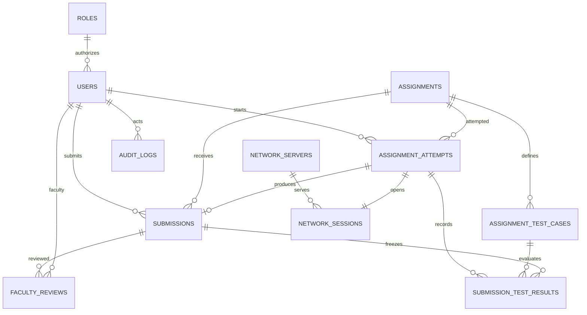

# PostgreSQL relational model

Flyway migrations are in lablink-backend/src/main/resources/db/migration.

- V1: users, assignments, attempts and submissions.
- V2: roles, seven assignment definitions, weighted tests, results, faculty reviews, services, network sessions and audit logs.
- V3: evaluation snapshots and explicit PASSED/FAILED/ERROR outcomes.
- V4: execution leases and recovery index.

Applied migrations are immutable. Future schema changes require a new migration. Application startup uses ddl-auto=validate.

## ER diagram



All application records use UUID keys except the role catalog, which uses its constrained role name. Foreign keys enforce relationships, email uniqueness is case insensitive, and attempt numbers are unique per student/assignment. One submission is allowed per attempt.

Assignments store metadata as JSONB and have optional deadlines. Test cases contain a type, weight, enabled flag and input/configuration JSON. The seven migrated definitions are the database source of truth; application APIs read/edit those rows. The assignment catalog is fixed at seven; faculty/admin can edit these definitions and create additional test cases.

## Evaluation history

Each execution captures test IDs, names, configurations and weights in assignment_attempts.evaluation_plan. Result rows store the evaluated name/weight/status, so faculty changes do not alter historical outcomes or scores. Complete and submit operations lock the attempt. Starting attempts locks the student row while assigning the next attempt number.

A submitted record freezes code, execution output, network log, automated score and result references. Faculty reviews are append-only; each review also updates the current grade, feedback and decision on the submission. Submitted attempts cannot execute again; returned work uses a new attempt.

## Inspection queries

```sql
SELECT title, protocol, status FROM assignments ORDER BY id;
SELECT role, count(*) FROM users GROUP BY role;
SELECT a.title, t.name, t.weight, t.enabled
FROM assignment_test_cases t JOIN assignments a ON a.id = t.assignment_id
ORDER BY a.id, t.name;
SELECT a.title, u.name, s.automated_score, s.faculty_grade, s.status
FROM submissions s JOIN users u ON u.id = s.student_id
JOIN assignments a ON a.id = s.assignment_id ORDER BY s.submitted_at DESC;
SELECT name, service, port, last_heartbeat FROM network_servers;
```

Indexes support student attempts, assignment/student submissions, result/review lookup, audit chronology and running-attempt recovery. Password hashes and token revocation fields are excluded from API serialization.
